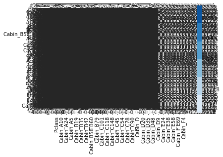

# Logistic Regression in SciKit Learn

## Introduction 

In this lecture, we'll briefly introduce logistic regression with the SciKit Learn package.

## Objectives

You will be able to:

* Understand and implement logistic regression
* Compare testing and training errors


### Objectives
YWBAT
* Compare and contrast logistic and linear regression
    * predicts a binary value vs continuous variable
    * logistic model - line between 0 and 1; linear model - straight line to infinity!
* Implement logistic regression on a dataset
* Explain logistic regression's use cases
    * Classification - To Categorize! to predict whether youre in one category vs another?
    * Probability - squishes your outcome between 0 and 1

Generally, the process for implementing logistic regression via SciKit Learn is very similar to that which we previously saw. There are a couple exceptions to this. First, rather than using patsy, we simply define y and X by specifying the columns from the dataframe, with no special syntax necessary. That said, if you need to create dummy variables for categorical variables, you must do this in a previous step manually. (See below.) Secondly, SciKit Learn will not display statistical measures such as the P-values associated with the various features. This is a shortcoming of SciKit Learn, although SciKit Learn has other useful tools for tuning models which we will investigate in future lessons.

The other main process of model building and evaluation which we failed to discuss previously is train test split. As we saw in linear regression, train test split is an essential part of model building in order to help determine how our model will generalize to future unseen cases. After all, the point of any model is to provide future predictions where we don't already know the answer but have other informative data (X).

With that, let's take a look at implementing Logistic Regression in SciKit Learn using dummy variables and a proper train-test split.

## Step 1: Import the Data


```python
import pandas as pd

df = pd.read_csv('titanic.csv')
df.head()
```


<div>
<style scoped>
    .dataframe tbody tr th:only-of-type {
        vertical-align: middle;
    }

    .dataframe tbody tr th {
        vertical-align: top;
    }

    .dataframe thead th {
        text-align: right;
    }
</style>
<table border="1" class="dataframe">
  <thead>
    <tr style="text-align: right;">
      <th></th>
      <th>PassengerId</th>
      <th>Survived</th>
      <th>Pclass</th>
      <th>Name</th>
      <th>Sex</th>
      <th>Age</th>
      <th>SibSp</th>
      <th>Parch</th>
      <th>Ticket</th>
      <th>Fare</th>
      <th>Cabin</th>
      <th>Embarked</th>
    </tr>
  </thead>
  <tbody>
    <tr>
      <th>0</th>
      <td>1</td>
      <td>0</td>
      <td>3</td>
      <td>Braund, Mr. Owen Harris</td>
      <td>male</td>
      <td>22.0</td>
      <td>1</td>
      <td>0</td>
      <td>A/5 21171</td>
      <td>7.2500</td>
      <td>NaN</td>
      <td>S</td>
    </tr>
    <tr>
      <th>1</th>
      <td>2</td>
      <td>1</td>
      <td>1</td>
      <td>Cumings, Mrs. John Bradley (Florence Briggs Th...</td>
      <td>female</td>
      <td>38.0</td>
      <td>1</td>
      <td>0</td>
      <td>PC 17599</td>
      <td>71.2833</td>
      <td>C85</td>
      <td>C</td>
    </tr>
    <tr>
      <th>2</th>
      <td>3</td>
      <td>1</td>
      <td>3</td>
      <td>Heikkinen, Miss. Laina</td>
      <td>female</td>
      <td>26.0</td>
      <td>0</td>
      <td>0</td>
      <td>STON/O2. 3101282</td>
      <td>7.9250</td>
      <td>NaN</td>
      <td>S</td>
    </tr>
    <tr>
      <th>3</th>
      <td>4</td>
      <td>1</td>
      <td>1</td>
      <td>Futrelle, Mrs. Jacques Heath (Lily May Peel)</td>
      <td>female</td>
      <td>35.0</td>
      <td>1</td>
      <td>0</td>
      <td>113803</td>
      <td>53.1000</td>
      <td>C123</td>
      <td>S</td>
    </tr>
    <tr>
      <th>4</th>
      <td>5</td>
      <td>0</td>
      <td>3</td>
      <td>Allen, Mr. William Henry</td>
      <td>male</td>
      <td>35.0</td>
      <td>0</td>
      <td>0</td>
      <td>373450</td>
      <td>8.0500</td>
      <td>NaN</td>
      <td>S</td>
    </tr>
  </tbody>
</table>
</div>


### Goal
Predict who survived and who didn't

## Step 2: Define X and y

Note that we first have to create our dummy variables, and then can use these to define X and y.


```python
df = pd.get_dummies(df)
print(df.columns)
df.head()
```

    Index(['PassengerId', 'Survived', 'Pclass', 'Age', 'SibSp', 'Parch', 'Fare',
           'Name_Abbing, Mr. Anthony', 'Name_Abbott, Mr. Rossmore Edward',
           'Name_Abbott, Mrs. Stanton (Rosa Hunt)',
           ...
           'Cabin_F G73', 'Cabin_F2', 'Cabin_F33', 'Cabin_F38', 'Cabin_F4',
           'Cabin_G6', 'Cabin_T', 'Embarked_C', 'Embarked_Q', 'Embarked_S'],
          dtype='object', length=1731)


<div>
<style scoped>
    .dataframe tbody tr th:only-of-type {
        vertical-align: middle;
    }

    .dataframe tbody tr th {
        vertical-align: top;
    }

    .dataframe thead th {
        text-align: right;
    }
</style>
<table border="1" class="dataframe">
  <thead>
    <tr style="text-align: right;">
      <th></th>
      <th>PassengerId</th>
      <th>Survived</th>
      <th>Pclass</th>
      <th>Age</th>
      <th>SibSp</th>
      <th>Parch</th>
      <th>Fare</th>
      <th>Name_Abbing, Mr. Anthony</th>
      <th>Name_Abbott, Mr. Rossmore Edward</th>
      <th>Name_Abbott, Mrs. Stanton (Rosa Hunt)</th>
      <th>...</th>
      <th>Cabin_F G73</th>
      <th>Cabin_F2</th>
      <th>Cabin_F33</th>
      <th>Cabin_F38</th>
      <th>Cabin_F4</th>
      <th>Cabin_G6</th>
      <th>Cabin_T</th>
      <th>Embarked_C</th>
      <th>Embarked_Q</th>
      <th>Embarked_S</th>
    </tr>
  </thead>
  <tbody>
    <tr>
      <th>0</th>
      <td>1</td>
      <td>0</td>
      <td>3</td>
      <td>22.0</td>
      <td>1</td>
      <td>0</td>
      <td>7.2500</td>
      <td>0</td>
      <td>0</td>
      <td>0</td>
      <td>...</td>
      <td>0</td>
      <td>0</td>
      <td>0</td>
      <td>0</td>
      <td>0</td>
      <td>0</td>
      <td>0</td>
      <td>0</td>
      <td>0</td>
      <td>1</td>
    </tr>
    <tr>
      <th>1</th>
      <td>2</td>
      <td>1</td>
      <td>1</td>
      <td>38.0</td>
      <td>1</td>
      <td>0</td>
      <td>71.2833</td>
      <td>0</td>
      <td>0</td>
      <td>0</td>
      <td>...</td>
      <td>0</td>
      <td>0</td>
      <td>0</td>
      <td>0</td>
      <td>0</td>
      <td>0</td>
      <td>0</td>
      <td>1</td>
      <td>0</td>
      <td>0</td>
    </tr>
    <tr>
      <th>2</th>
      <td>3</td>
      <td>1</td>
      <td>3</td>
      <td>26.0</td>
      <td>0</td>
      <td>0</td>
      <td>7.9250</td>
      <td>0</td>
      <td>0</td>
      <td>0</td>
      <td>...</td>
      <td>0</td>
      <td>0</td>
      <td>0</td>
      <td>0</td>
      <td>0</td>
      <td>0</td>
      <td>0</td>
      <td>0</td>
      <td>0</td>
      <td>1</td>
    </tr>
    <tr>
      <th>3</th>
      <td>4</td>
      <td>1</td>
      <td>1</td>
      <td>35.0</td>
      <td>1</td>
      <td>0</td>
      <td>53.1000</td>
      <td>0</td>
      <td>0</td>
      <td>0</td>
      <td>...</td>
      <td>0</td>
      <td>0</td>
      <td>0</td>
      <td>0</td>
      <td>0</td>
      <td>0</td>
      <td>0</td>
      <td>0</td>
      <td>0</td>
      <td>1</td>
    </tr>
    <tr>
      <th>4</th>
      <td>5</td>
      <td>0</td>
      <td>3</td>
      <td>35.0</td>
      <td>0</td>
      <td>0</td>
      <td>8.0500</td>
      <td>0</td>
      <td>0</td>
      <td>0</td>
      <td>...</td>
      <td>0</td>
      <td>0</td>
      <td>0</td>
      <td>0</td>
      <td>0</td>
      <td>0</td>
      <td>0</td>
      <td>0</td>
      <td>0</td>
      <td>1</td>
    </tr>
  </tbody>
</table>
<p>5 rows × 1731 columns</p>
</div>


Wow! That's a lot of columns! (Way more then is useful in practice: we now have columns for each of the passengers names. This is an example of what not to do. Let's try that again, this time being mindful of which variables we actually want to include in our model.


```python
df = pd.read_csv('titanic.csv')
df.head()
```


<div>
<style scoped>
    .dataframe tbody tr th:only-of-type {
        vertical-align: middle;
    }

    .dataframe tbody tr th {
        vertical-align: top;
    }

    .dataframe thead th {
        text-align: right;
    }
</style>
<table border="1" class="dataframe">
  <thead>
    <tr style="text-align: right;">
      <th></th>
      <th>PassengerId</th>
      <th>Survived</th>
      <th>Pclass</th>
      <th>Name</th>
      <th>Sex</th>
      <th>Age</th>
      <th>SibSp</th>
      <th>Parch</th>
      <th>Ticket</th>
      <th>Fare</th>
      <th>Cabin</th>
      <th>Embarked</th>
    </tr>
  </thead>
  <tbody>
    <tr>
      <th>0</th>
      <td>1</td>
      <td>0</td>
      <td>3</td>
      <td>Braund, Mr. Owen Harris</td>
      <td>male</td>
      <td>22.0</td>
      <td>1</td>
      <td>0</td>
      <td>A/5 21171</td>
      <td>7.2500</td>
      <td>NaN</td>
      <td>S</td>
    </tr>
    <tr>
      <th>1</th>
      <td>2</td>
      <td>1</td>
      <td>1</td>
      <td>Cumings, Mrs. John Bradley (Florence Briggs Th...</td>
      <td>female</td>
      <td>38.0</td>
      <td>1</td>
      <td>0</td>
      <td>PC 17599</td>
      <td>71.2833</td>
      <td>C85</td>
      <td>C</td>
    </tr>
    <tr>
      <th>2</th>
      <td>3</td>
      <td>1</td>
      <td>3</td>
      <td>Heikkinen, Miss. Laina</td>
      <td>female</td>
      <td>26.0</td>
      <td>0</td>
      <td>0</td>
      <td>STON/O2. 3101282</td>
      <td>7.9250</td>
      <td>NaN</td>
      <td>S</td>
    </tr>
    <tr>
      <th>3</th>
      <td>4</td>
      <td>1</td>
      <td>1</td>
      <td>Futrelle, Mrs. Jacques Heath (Lily May Peel)</td>
      <td>female</td>
      <td>35.0</td>
      <td>1</td>
      <td>0</td>
      <td>113803</td>
      <td>53.1000</td>
      <td>C123</td>
      <td>S</td>
    </tr>
    <tr>
      <th>4</th>
      <td>5</td>
      <td>0</td>
      <td>3</td>
      <td>Allen, Mr. William Henry</td>
      <td>male</td>
      <td>35.0</td>
      <td>0</td>
      <td>0</td>
      <td>373450</td>
      <td>8.0500</td>
      <td>NaN</td>
      <td>S</td>
    </tr>
  </tbody>
</table>
</div>


```python
x_feats = ['Pclass', 'Sex', 'Age', 'SibSp', 'Fare', 'Cabin', 'Embarked']
X = pd.get_dummies(df[x_feats], drop_first=True)
y = df.Survived
X.head() #Preview our data to make sure it looks reasonable
```


<div>
<style scoped>
    .dataframe tbody tr th:only-of-type {
        vertical-align: middle;
    }

    .dataframe tbody tr th {
        vertical-align: top;
    }

    .dataframe thead th {
        text-align: right;
    }
</style>
<table border="1" class="dataframe">
  <thead>
    <tr style="text-align: right;">
      <th></th>
      <th>Pclass</th>
      <th>Age</th>
      <th>SibSp</th>
      <th>Fare</th>
      <th>Sex_male</th>
      <th>Cabin_A14</th>
      <th>Cabin_A16</th>
      <th>Cabin_A19</th>
      <th>Cabin_A20</th>
      <th>Cabin_A23</th>
      <th>...</th>
      <th>Cabin_F G63</th>
      <th>Cabin_F G73</th>
      <th>Cabin_F2</th>
      <th>Cabin_F33</th>
      <th>Cabin_F38</th>
      <th>Cabin_F4</th>
      <th>Cabin_G6</th>
      <th>Cabin_T</th>
      <th>Embarked_Q</th>
      <th>Embarked_S</th>
    </tr>
  </thead>
  <tbody>
    <tr>
      <th>0</th>
      <td>3</td>
      <td>22.0</td>
      <td>1</td>
      <td>7.2500</td>
      <td>1</td>
      <td>0</td>
      <td>0</td>
      <td>0</td>
      <td>0</td>
      <td>0</td>
      <td>...</td>
      <td>0</td>
      <td>0</td>
      <td>0</td>
      <td>0</td>
      <td>0</td>
      <td>0</td>
      <td>0</td>
      <td>0</td>
      <td>0</td>
      <td>1</td>
    </tr>
    <tr>
      <th>1</th>
      <td>1</td>
      <td>38.0</td>
      <td>1</td>
      <td>71.2833</td>
      <td>0</td>
      <td>0</td>
      <td>0</td>
      <td>0</td>
      <td>0</td>
      <td>0</td>
      <td>...</td>
      <td>0</td>
      <td>0</td>
      <td>0</td>
      <td>0</td>
      <td>0</td>
      <td>0</td>
      <td>0</td>
      <td>0</td>
      <td>0</td>
      <td>0</td>
    </tr>
    <tr>
      <th>2</th>
      <td>3</td>
      <td>26.0</td>
      <td>0</td>
      <td>7.9250</td>
      <td>0</td>
      <td>0</td>
      <td>0</td>
      <td>0</td>
      <td>0</td>
      <td>0</td>
      <td>...</td>
      <td>0</td>
      <td>0</td>
      <td>0</td>
      <td>0</td>
      <td>0</td>
      <td>0</td>
      <td>0</td>
      <td>0</td>
      <td>0</td>
      <td>1</td>
    </tr>
    <tr>
      <th>3</th>
      <td>1</td>
      <td>35.0</td>
      <td>1</td>
      <td>53.1000</td>
      <td>0</td>
      <td>0</td>
      <td>0</td>
      <td>0</td>
      <td>0</td>
      <td>0</td>
      <td>...</td>
      <td>0</td>
      <td>0</td>
      <td>0</td>
      <td>0</td>
      <td>0</td>
      <td>0</td>
      <td>0</td>
      <td>0</td>
      <td>0</td>
      <td>1</td>
    </tr>
    <tr>
      <th>4</th>
      <td>3</td>
      <td>35.0</td>
      <td>0</td>
      <td>8.0500</td>
      <td>1</td>
      <td>0</td>
      <td>0</td>
      <td>0</td>
      <td>0</td>
      <td>0</td>
      <td>...</td>
      <td>0</td>
      <td>0</td>
      <td>0</td>
      <td>0</td>
      <td>0</td>
      <td>0</td>
      <td>0</td>
      <td>0</td>
      <td>0</td>
      <td>1</td>
    </tr>
  </tbody>
</table>
<p>5 rows × 153 columns</p>
</div>


## Normalization

Another important model tuning practice is to normalize your data. That is, if the features are on different scales, some features may impact the model more heavily then others. To level the playing field, we often normalize all features to a consistent scale of 0 to 1.


```python
X = X.fillna(value=0) #Fill null values
for col in X.columns:
    X[col] = (X[col]-min(X[col]))/ (max(X[col]) - min(X[col])) #We subtract the minimum and divide by the range forcing a scale of 0 to 1 for each feature

X.head()
```


<div>
<style scoped>
    .dataframe tbody tr th:only-of-type {
        vertical-align: middle;
    }

    .dataframe tbody tr th {
        vertical-align: top;
    }

    .dataframe thead th {
        text-align: right;
    }
</style>
<table border="1" class="dataframe">
  <thead>
    <tr style="text-align: right;">
      <th></th>
      <th>Pclass</th>
      <th>Age</th>
      <th>SibSp</th>
      <th>Fare</th>
      <th>Sex_male</th>
      <th>Cabin_A14</th>
      <th>Cabin_A16</th>
      <th>Cabin_A19</th>
      <th>Cabin_A20</th>
      <th>Cabin_A23</th>
      <th>...</th>
      <th>Cabin_F G63</th>
      <th>Cabin_F G73</th>
      <th>Cabin_F2</th>
      <th>Cabin_F33</th>
      <th>Cabin_F38</th>
      <th>Cabin_F4</th>
      <th>Cabin_G6</th>
      <th>Cabin_T</th>
      <th>Embarked_Q</th>
      <th>Embarked_S</th>
    </tr>
  </thead>
  <tbody>
    <tr>
      <th>0</th>
      <td>1.0</td>
      <td>0.2750</td>
      <td>0.125</td>
      <td>0.014151</td>
      <td>1.0</td>
      <td>0.0</td>
      <td>0.0</td>
      <td>0.0</td>
      <td>0.0</td>
      <td>0.0</td>
      <td>...</td>
      <td>0.0</td>
      <td>0.0</td>
      <td>0.0</td>
      <td>0.0</td>
      <td>0.0</td>
      <td>0.0</td>
      <td>0.0</td>
      <td>0.0</td>
      <td>0.0</td>
      <td>1.0</td>
    </tr>
    <tr>
      <th>1</th>
      <td>0.0</td>
      <td>0.4750</td>
      <td>0.125</td>
      <td>0.139136</td>
      <td>0.0</td>
      <td>0.0</td>
      <td>0.0</td>
      <td>0.0</td>
      <td>0.0</td>
      <td>0.0</td>
      <td>...</td>
      <td>0.0</td>
      <td>0.0</td>
      <td>0.0</td>
      <td>0.0</td>
      <td>0.0</td>
      <td>0.0</td>
      <td>0.0</td>
      <td>0.0</td>
      <td>0.0</td>
      <td>0.0</td>
    </tr>
    <tr>
      <th>2</th>
      <td>1.0</td>
      <td>0.3250</td>
      <td>0.000</td>
      <td>0.015469</td>
      <td>0.0</td>
      <td>0.0</td>
      <td>0.0</td>
      <td>0.0</td>
      <td>0.0</td>
      <td>0.0</td>
      <td>...</td>
      <td>0.0</td>
      <td>0.0</td>
      <td>0.0</td>
      <td>0.0</td>
      <td>0.0</td>
      <td>0.0</td>
      <td>0.0</td>
      <td>0.0</td>
      <td>0.0</td>
      <td>1.0</td>
    </tr>
    <tr>
      <th>3</th>
      <td>0.0</td>
      <td>0.4375</td>
      <td>0.125</td>
      <td>0.103644</td>
      <td>0.0</td>
      <td>0.0</td>
      <td>0.0</td>
      <td>0.0</td>
      <td>0.0</td>
      <td>0.0</td>
      <td>...</td>
      <td>0.0</td>
      <td>0.0</td>
      <td>0.0</td>
      <td>0.0</td>
      <td>0.0</td>
      <td>0.0</td>
      <td>0.0</td>
      <td>0.0</td>
      <td>0.0</td>
      <td>1.0</td>
    </tr>
    <tr>
      <th>4</th>
      <td>1.0</td>
      <td>0.4375</td>
      <td>0.000</td>
      <td>0.015713</td>
      <td>1.0</td>
      <td>0.0</td>
      <td>0.0</td>
      <td>0.0</td>
      <td>0.0</td>
      <td>0.0</td>
      <td>...</td>
      <td>0.0</td>
      <td>0.0</td>
      <td>0.0</td>
      <td>0.0</td>
      <td>0.0</td>
      <td>0.0</td>
      <td>0.0</td>
      <td>0.0</td>
      <td>0.0</td>
      <td>1.0</td>
    </tr>
  </tbody>
</table>
<p>5 rows × 153 columns</p>
</div>


## Train-Test Split


```python
from sklearn.model_selection import train_test_split
```


```python
X_train, X_test, y_train, y_test = train_test_split(X, y, random_state=0)
```

## Fit a model
Fit an intial model to the training set. In SciKit Learn you do this by first creating an instance of the regression class. From there, then use the **fit** method from your class instance to fit a model to the training data.


```python
from sklearn.linear_model import LogisticRegression

logreg = LogisticRegression(fit_intercept = False, C = 1e12)
model_log = logreg.fit(X_train, y_train)
model_log
```

    /anaconda3/lib/python3.6/site-packages/sklearn/linear_model/logistic.py:433: FutureWarning: Default solver will be changed to 'lbfgs' in 0.22. Specify a solver to silence this warning.
      FutureWarning)


    LogisticRegression(C=1000000000000.0, class_weight=None, dual=False,
              fit_intercept=False, intercept_scaling=1, max_iter=100,
              multi_class='warn', n_jobs=None, penalty='l2', random_state=None,
              solver='warn', tol=0.0001, verbose=0, warm_start=False)


## Predict
Now that we have a model, lets take a look at how it performs on our test set.


```python
y_hat_test = logreg.predict(X_test)
y_hat_train = logreg.predict(X_train)
```


```python
import numpy as np
#We could subtract the two columns. If values or equal, difference will be zero. Then count number of zeros.
residuals = np.abs(y_train - y_hat_train)
print(pd.Series(residuals).value_counts())
print(pd.Series(residuals).value_counts(normalize=True))
```

    0    563
    1    105
    Name: Survived, dtype: int64
    0    0.842814
    1    0.157186
    Name: Survived, dtype: float64


Not bad; our classifier was 85% correct for our training data!


```python
residuals = np.abs(y_test - y_hat_test)
print(pd.Series(residuals).value_counts())
print(pd.Series(residuals).value_counts(normalize=True))
```

    0    174
    1     49
    Name: Survived, dtype: int64
    0    0.780269
    1    0.219731
    Name: Survived, dtype: float64


And still 80% accurate for our test data!


```python
for feature, weight in zip(X.columns, logreg.coef_[0]):
    print("{} has a weight of : {}".format(feature, weight))
```

    Pclass has a weight of : 0.13042974895979145
    Age has a weight of : -0.5774106802089147
    SibSp has a weight of : -3.54039087991434
    Fare has a weight of : 11.376643697655865
    Sex_male has a weight of : -2.3418675134977955
    Cabin_A14 has a weight of : -8.02428836277532
    Cabin_A16 has a weight of : 8.703052532292002
    Cabin_A19 has a weight of : -7.445920643230202
    Cabin_A20 has a weight of : 10.667340884311034
    Cabin_A23 has a weight of : 10.631947580020057
    Cabin_A24 has a weight of : -7.7672044551432515
    Cabin_A26 has a weight of : 0.0
    Cabin_A31 has a weight of : 10.73639385698308
    Cabin_A32 has a weight of : -7.979798424720359
    Cabin_A34 has a weight of : 8.930136150260537
    Cabin_A36 has a weight of : -6.586227366794879
    Cabin_A5 has a weight of : -6.711027946017985
    Cabin_A6 has a weight of : 10.134489017759151
    Cabin_A7 has a weight of : -6.731177177627183
    Cabin_B101 has a weight of : 0.9055587053331994
    Cabin_B102 has a weight of : 0.0
    Cabin_B18 has a weight of : 7.6205646968486676
    Cabin_B19 has a weight of : -7.172726803707565
    Cabin_B20 has a weight of : 10.204029858377595
    Cabin_B22 has a weight of : -0.21733162265791686
    Cabin_B28 has a weight of : 8.073092549793866
    Cabin_B3 has a weight of : 3.9891760645779675
    Cabin_B30 has a weight of : 0.0
    Cabin_B35 has a weight of : 8.119813552774808
    Cabin_B37 has a weight of : 0.0
    Cabin_B38 has a weight of : -7.133542412288757
    Cabin_B39 has a weight of : 7.852462780906377
    Cabin_B4 has a weight of : 8.495634851408731
    Cabin_B41 has a weight of : 0.0
    Cabin_B42 has a weight of : 0.0
    Cabin_B49 has a weight of : 7.348722831108299
    Cabin_B5 has a weight of : 4.532207869074364
    Cabin_B50 has a weight of : 0.0
    Cabin_B51 B53 B55 has a weight of : -3.3603538203370524
    Cabin_B57 B59 B63 B66 has a weight of : 0.0
    Cabin_B58 B60 has a weight of : -11.78536876198654
    Cabin_B69 has a weight of : 7.117683174871221
    Cabin_B71 has a weight of : 0.0
    Cabin_B73 has a weight of : 6.516173784671981
    Cabin_B77 has a weight of : 7.376127792864385
    Cabin_B78 has a weight of : 0.0
    Cabin_B79 has a weight of : 6.570894229043576
    Cabin_B80 has a weight of : 5.953993000605139
    Cabin_B82 B84 has a weight of : -7.882288686086405
    Cabin_B86 has a weight of : -8.040988465923512
    Cabin_B94 has a weight of : -6.579013881926475
    Cabin_B96 B98 has a weight of : 8.768438540211273
    Cabin_C101 has a weight of : 8.50244430390586
    Cabin_C103 has a weight of : 8.207431322949716
    Cabin_C104 has a weight of : 10.418841251256353
    Cabin_C106 has a weight of : 0.0
    Cabin_C110 has a weight of : -7.685247436123722
    Cabin_C111 has a weight of : -6.853201504328393
    Cabin_C118 has a weight of : -6.846083739741217
    Cabin_C123 has a weight of : 0.2787438049345006
    Cabin_C124 has a weight of : -7.458155310637267
    Cabin_C125 has a weight of : 5.384346539089307
    Cabin_C126 has a weight of : 7.6657217040006715
    Cabin_C128 has a weight of : -7.646124484157252
    Cabin_C148 has a weight of : 10.657647279157795
    Cabin_C2 has a weight of : -0.09689064458439177
    Cabin_C22 C26 has a weight of : -3.4053882295105273
    Cabin_C23 C25 C27 has a weight of : -3.3902514250296902
    Cabin_C30 has a weight of : -7.14927370803655
    Cabin_C32 has a weight of : 6.037479390698524
    Cabin_C45 has a weight of : 4.008458865733887
    Cabin_C46 has a weight of : -7.919062039754119
    Cabin_C47 has a weight of : 0.0
    Cabin_C49 has a weight of : -9.072901979924422
    Cabin_C50 has a weight of : 7.349014504859095
    Cabin_C52 has a weight of : 10.333580095719546
    Cabin_C54 has a weight of : 0.0
    Cabin_C62 C64 has a weight of : 0.0
    Cabin_C65 has a weight of : 6.937883853708865
    Cabin_C68 has a weight of : -0.5312753490787604
    Cabin_C7 has a weight of : 0.0
    Cabin_C70 has a weight of : 8.79350875451802
    Cabin_C78 has a weight of : -7.787537708328526
    Cabin_C82 has a weight of : -10.962416564608011
    Cabin_C83 has a weight of : 0.0
    Cabin_C85 has a weight of : 0.0
    Cabin_C86 has a weight of : -8.016244184174239
    Cabin_C87 has a weight of : 0.0
    Cabin_C90 has a weight of : 7.866796667311513
    Cabin_C91 has a weight of : -10.007224196564326
    Cabin_C92 has a weight of : 10.016965846014159
    Cabin_C93 has a weight of : 9.527034080006768
    Cabin_C95 has a weight of : -11.801086810659353
    Cabin_C99 has a weight of : 5.61502730408256
    Cabin_D has a weight of : 1.3933952748894143
    Cabin_D10 D12 has a weight of : 0.0
    Cabin_D11 has a weight of : 7.456187086519087
    Cabin_D15 has a weight of : 7.3286303526175525
    Cabin_D17 has a weight of : 8.149103727270898
    Cabin_D19 has a weight of : 10.298926080290665
    Cabin_D20 has a weight of : 7.871781340940489
    Cabin_D21 has a weight of : 7.668780344122752
    Cabin_D26 has a weight of : -9.016729938534384
    Cabin_D28 has a weight of : 7.618611619916662
    Cabin_D30 has a weight of : -7.468884961785634
    Cabin_D33 has a weight of : 10.312129386373755
    Cabin_D35 has a weight of : 10.361209266788387
    Cabin_D36 has a weight of : 6.883846526081296
    Cabin_D37 has a weight of : 7.996596253184839
    Cabin_D45 has a weight of : 0.0
    Cabin_D46 has a weight of : -7.285301848080059
    Cabin_D47 has a weight of : 7.932029924554798
    Cabin_D48 has a weight of : -8.553730963865643
    Cabin_D49 has a weight of : 0.0
    Cabin_D50 has a weight of : -7.146495734477324
    Cabin_D56 has a weight of : 10.613007389856937
    Cabin_D6 has a weight of : -7.325704568804426
    Cabin_D7 has a weight of : 7.542751771315535
    Cabin_D9 has a weight of : 0.0
    Cabin_E10 has a weight of : 10.643419726836171
    Cabin_E101 has a weight of : 9.263175518425303
    Cabin_E12 has a weight of : 10.477853553481134
    Cabin_E121 has a weight of : 10.463488177366957
    Cabin_E17 has a weight of : 10.499494611091885
    Cabin_E24 has a weight of : 11.108848382055566
    Cabin_E25 has a weight of : 11.089384055194936
    Cabin_E31 has a weight of : -7.453745387827915
    Cabin_E33 has a weight of : 7.156177240604441
    Cabin_E34 has a weight of : 0.0
    Cabin_E36 has a weight of : 7.744912544570219
    Cabin_E38 has a weight of : -6.989271561555821
    Cabin_E40 has a weight of : 6.098754652878941
    Cabin_E44 has a weight of : 0.27790860286936997
    Cabin_E46 has a weight of : -7.631693532633692
    Cabin_E49 has a weight of : 7.669191969050121
    Cabin_E50 has a weight of : 10.527301502804708
    Cabin_E58 has a weight of : -7.097704667421745
    Cabin_E63 has a weight of : -7.3849410274027445
    Cabin_E67 has a weight of : 7.3319915756137775
    Cabin_E68 has a weight of : 6.737695324929514
    Cabin_E77 has a weight of : -9.097781815263625
    Cabin_E8 has a weight of : 10.274263799477243
    Cabin_F E69 has a weight of : 8.609788433671545
    Cabin_F G63 has a weight of : -6.865300420080454
    Cabin_F G73 has a weight of : 0.0
    Cabin_F2 has a weight of : 1.6439564869469792
    Cabin_F33 has a weight of : 8.938566826407486
    Cabin_F38 has a weight of : -7.291464071716106
    Cabin_F4 has a weight of : 10.775945152110452
    Cabin_G6 has a weight of : -0.7538231765396892
    Cabin_T has a weight of : -7.332633609433644
    Embarked_Q has a weight of : 0.5365372625134176
    Embarked_S has a weight of : 0.4155000059696362


```python
import seaborn as sns
```


```python
sns.heatmap(X.corr(), cmap=sns.color_palette('Blues'), annot=True, fmt='0.16g')
```


    <matplotlib.axes._subplots.AxesSubplot at 0x1a18895f98>





```python
X[['Sex_male', 'Sex_male']].corr()
```


<div>
<style scoped>
    .dataframe tbody tr th:only-of-type {
        vertical-align: middle;
    }

    .dataframe tbody tr th {
        vertical-align: top;
    }

    .dataframe thead th {
        text-align: right;
    }
</style>
<table border="1" class="dataframe">
  <thead>
    <tr style="text-align: right;">
      <th></th>
      <th>Sex_male</th>
      <th>Sex_male</th>
    </tr>
  </thead>
  <tbody>
    <tr>
      <th>Sex_male</th>
      <td>1.0</td>
      <td>1.0</td>
    </tr>
    <tr>
      <th>Sex_male</th>
      <td>1.0</td>
      <td>1.0</td>
    </tr>
  </tbody>
</table>
</div>


## Summary

In this lesson, we took a more complete look at a data science pipeline for logistic regression, splitting the data into train and test sets and using the model to make predictions. You'll practice this on your own in the upcoming lab before then having a more detailed discussion of more nuanced methods for evaluating our classifier's performance.


```python
# labels = [computers, art, cooking, students, sleep]
```


```python
# One approach for multiclass classification
# m0 logreg_computers  {0: not_computers, 1: computers}, 
# m1 logreg_art {0: not_art, 1:art}, 
# m2 w*logreg_cooking, 
# m3 w*logreg_students, 
# m4 w*logreg_sleep
```


```python
# predict on (x) 
# max(mi(x))
```
